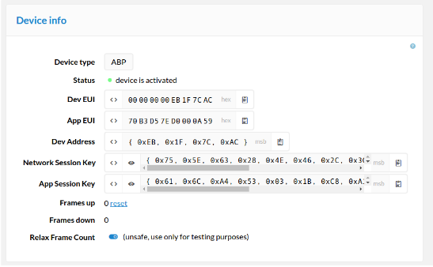
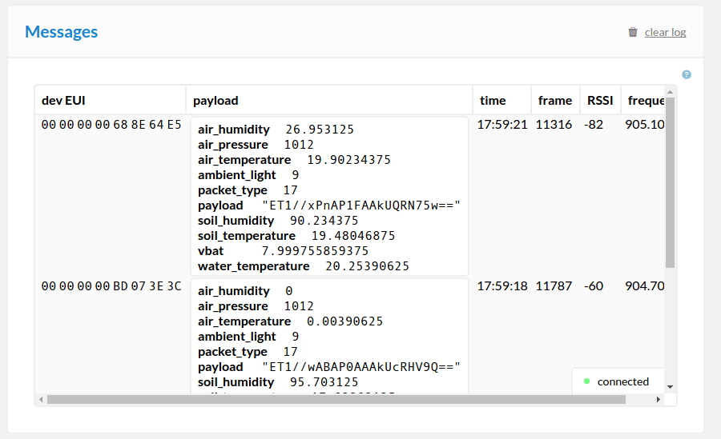

Smart Rain Gardens for Greener Cities
=====================================

TODO:

Intro, discuss need for rain gardens in cities,
and how IoT can help make them more awesome.

Overview of demo'd solution,
including block diagram

Discuss each piece of the system:

Why Smart Rain Gardens
-----

Overview of Solution
-------

Hardware
-------

The first thing to consider when building an Internet of Things device is,
what exactly is being measured? For a rain garden,
we want to know the temperature and moisture of the growing soil,
the temperature of water leaving the drain spout and entering the garden,
as well as environmental conditions like light level, air temperature, and humidity.

To monitor these variables, we will need a suite of sensors.
We selected the following sensors:

 - [Ambient Light Sensor](https://www.adafruit.com/products/439)  (TSL2561)
 - [Soil Temperature and Moisture Sensor](https://www.adafruit.com/products/1298) (SHT10)
 - [Water Temperature Sensor](https://www.adafruit.com/products/381) (DS18B20)
 - [Air Temperature and Humidity Sensor](https://www.adafruit.com/products/385) (DHT22)

Next we need a microcontroller to read from the sensors, and a radio to send sensor data up to the internet.
There are many options here. We settled on mDot from MultiTech because it combines a microcontroller and radio into an easy-to-use yet powerful package:

 - [MultiTech mDot](http://www.multitech.com/models/94557148LF) (MTDOT-915-X1P-SMA-1)
 - [mDot Developer Kit](http://www.multitech.com/models/94558010LF) (MTUDK2-ST-MDOT)

Lastly, we need just a few miscellaneous components:

 - Thin hookup wire (30AWG "wirewrap" wire works great)
 - 2x 4.7kOhm thru-hole resistors

And a few tools:

 - Soldering Tools (iron, solder, flux, needle-nose pliers)
 - Safety glasses
 - An area with good ventilation to solder your components
 - Notebook for notes while wiring
 - Laptop for firmware development and debugging
 - Desk vise like [Panavise](http://www.panavise.com/) for holding circuit boards
 - Oscilloscope (optional) for hardware debugging

TODO: Assembly instructions, with pinouts.

Firmware
-------

With the node constructed, it's time to write firmware to breathe life into the device!

We used the [ARM mBed](https://developer.mbed.org/) platform for wiring firmware. While traditional development environments (IDEs like Arduino, IAR, Keil) require a software installation, mBed works entirely in your web browser, making it easy to get started.

On mBed, the first step is to find an example application for using the mDot. We started with a [project](https://developer.mbed.org/users/merckeng/code/mDot_TTN_DHT11/) that demonstrated using the mDot to read a DHT11 sensor and send data to The Things Network. However, we still need to teach the mDot to read from the sensors we have selected. For this, we need *libraries*.

By using the mBed compiler's "import" tool, we found a library for each of our sensors:

 - [DHT22 Library by Julepalme](http://mbed.org/users/Julepalme/code/DHT22/)
 - [DS18B20 Library from Richard Lane](https://developer.mbed.org/users/richardlane/code/DS18B20_1wire/)
 - [SHTx Library courtesy of Ron of NegativeBlack](https://developer.mbed.org/users/richardlane/code/DS18B20_1wire/)
 - [TSL2561_I2C Library by Karl Maxwell](https://developer.mbed.org/users/karlmaxwell67/code/TSL2561_I2C/)

We imported each of the libraries into our mBed project, and added code to use the libraries, initialize the sensors, read data, and prepare the data for sending to The Things Network. To get started right away, you can [click here](https://developer.mbed.org/users/merckeng/code/mDot_TTN_DHT11_Boston16_CAM/) to fork the project repository on mBed. Note that this code reads from all sensors and sends a packet of data every 5 seconds. *This is for testing and demonstration purposes only!* In a real application, you will only want to send about one packet per hour to conserve spectrum for other users.

Putting the code onto the mDot is incredibly easy with mBed: Just plug the development board into your laptop using the USB cable. A storage 'drive' will appear, that looks on your PC like a USB flash drive. You then click "compile" in mBed, a '.bin' file downloads to your computer, and you simply drag-and-drop it from the downloads folder into the 'drive'. You will see flashing lights on the development board, and soon it will start running your program.

You can get a view into what is going on inside the mDot by opening a serial terminal program on your PC (like RealTerm or TeraTerm on Windows, or "screen" on OSX and Linux):

    screen /dev/ttyACM0 115200

The Things Network
-----------------

Now that the hardware is transmitting data, we need to register our device with an Application on The Things Network.

We assume that you have The Things Network coverage already. If you live far away from civilization, you may need to [setup your own gateway](https://www.google.com/webhp?sourceid=chrome-instant&ion=1&espv=2&ie=UTF-8#safe=active&q=how+to+setup+the+things+network+gateway+).

To setup our application, we go to [The Things Network dashboard](https://account.thethingsnetwork.org/). You create an account, and then follow a few steps:

 - Click on "Create an Application" and follow the on-screen instructions.
 - Copy the App EUI. This number uniquely identifies your application.

 - Next click on "Register a Device"
 - Select ABP (Activation by Personalization)
 - Click "Register"

 - Copy the Dev Address, App Session Key, and Network Session Keys in the "msb" format.
 - Click "Relax Frame Count" (this is OK to do for development nodes, but *not* in production).

Now that you have copied Dev Address, App Session Key, and Network Session Key, go back to mBed and add these strings to the main.cpp file. This will uniquely identify your node on TTN and provide encryption over-the-air (and over-the-Internet). Recompile and download to your node.

Now you should see packets arriving in the "Messages" window of the TTN dashboard.
But these packets are in binary, and difficult for humans (and JavaScript) to deal with.
So we will click on "edit" next to Payload Functions in the Application page of the TTN dashboard,
and paste the following code:

	function (bytes) {
	 // Decoder
	 // Here can decode the payload into json.
	 // bytes is of type Buffer.
	 retval = {payload: bytes};
	 retval['packet_type'] = bytes[0];
	 /* check for packet type in first byte */
	 if (bytes[0] != 0x11) {
	   retval['error'] = "Unknown packet type.";
	   return retval;
	 }
	 // for now, we assume all sensors present.
	 int16_to_float = function(b0,b1) {
	   // convert from two's compliment
	   if (b0 >= 128) {
	     b0 -= 256;
	   }
	   return 256*b0+b1;
	 };
	 uint16_to_float = function(b0,b1) {
	   // convert from two's compliment
	   return 256*b0+b1;
	 };
	 retval['vbat'] = int16_to_float(bytes[2],bytes[3])/4096;
	 retval['air_temperature'] = int16_to_float(bytes[4],bytes[5])/256;
	 retval['air_pressure'] = uint16_to_float(bytes[6],bytes[7])*4;
	 retval['air_humidity'] = bytes[8]*0.390625;
	 retval['ambient_light'] = uint16_to_float(bytes[9],bytes[10]);
	 retval['water_temperature'] = int16_to_float(bytes[11],bytes[12])/256;
	 retval['soil_temperature'] = int16_to_float(bytes[13],bytes[14])/256;
	 retval['soil_humidity'] = bytes[15]*0.390625;
	 return retval;
	}

Now packets will be decoded into human-readable fields in the Messages panel (and in MQTT):

Scriptr
-------

mqtt to rest bridge
dataviz

Call to Action
----

follow Scriptr, Multitech, and TTN NY on Twitter ?
